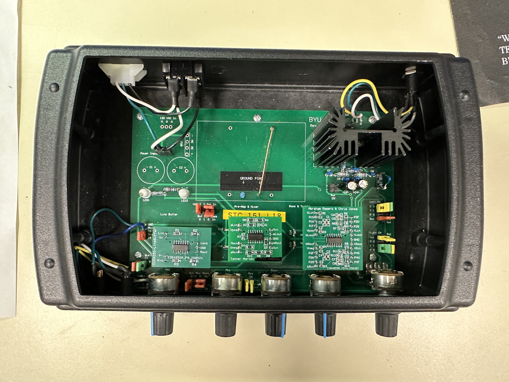
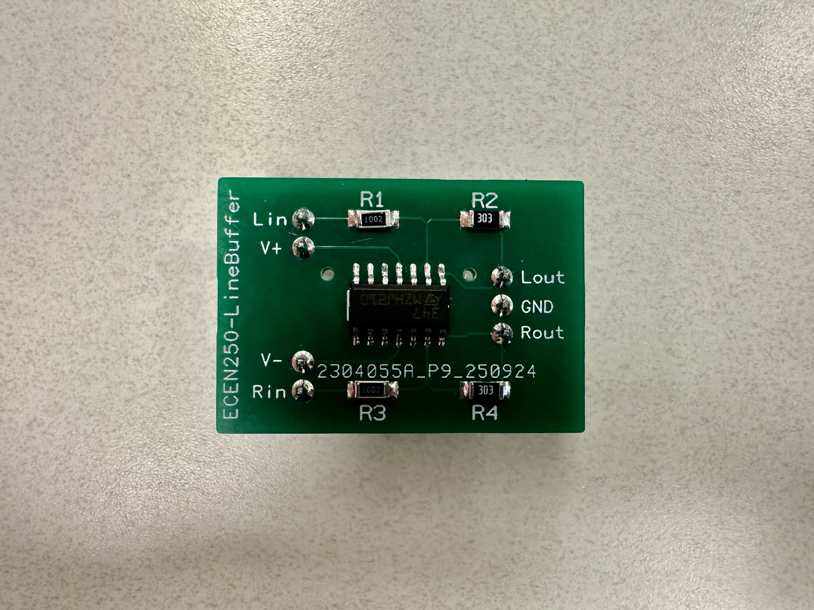
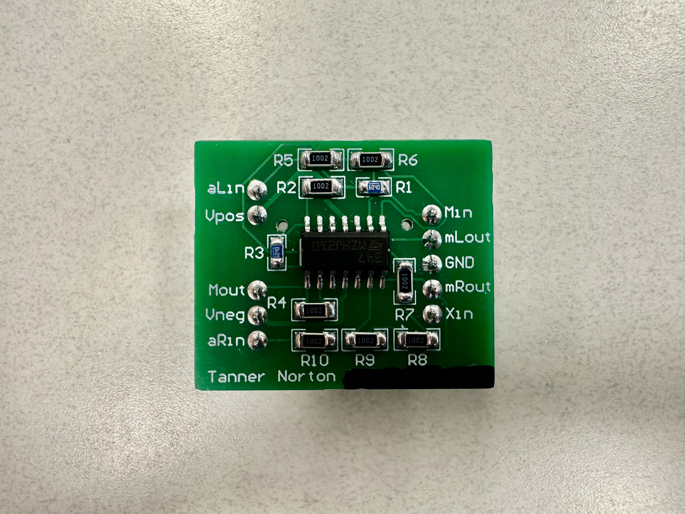
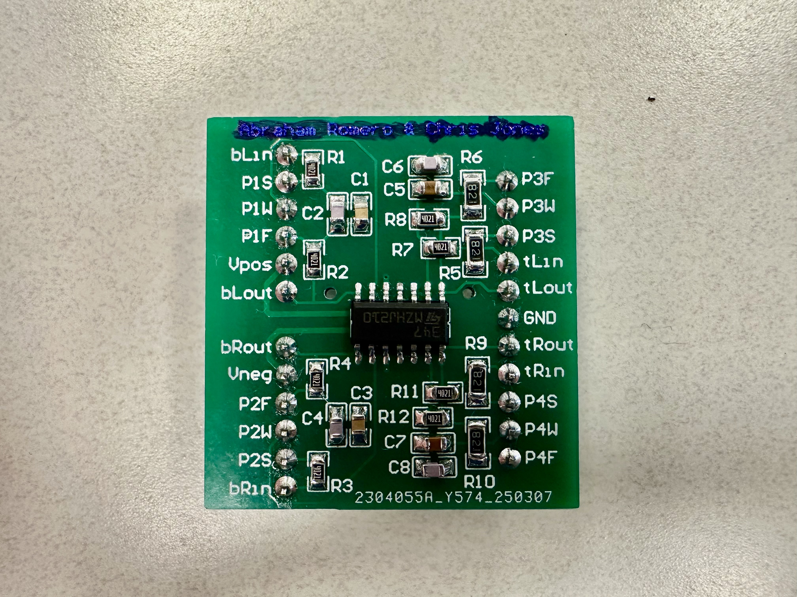
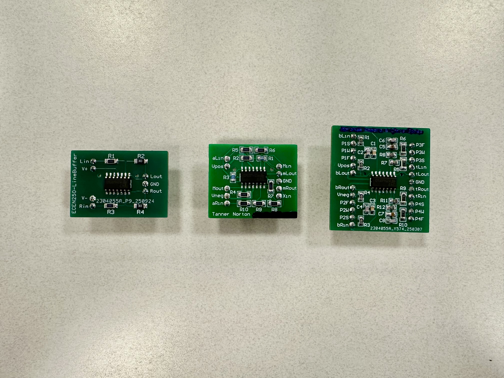

# Audio-Amplifier
Audio amplifier system including line buffer, left and right channels, microphone input mixer, and bass/treble amplification and attenuation.

## Photos

### Overall System

### Line Buffer

### Mixer

### Bass/Treble Stage

### Daughterboards

